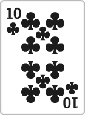
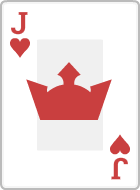

# Image Previews

 die1.png

 die2.png

 die3.png

 die4.png

 die5.png

 die6.png

 piece0.png

 piece1.png

 piece10.png

 piece11.png

 piece2.png

 piece3.png

 piece4.png

 piece5.png

 piece6.png

 piece7.png

 piece8.png

 piece9.png

 cardBack.png

 cardClubs10.png

 cardClubs2.png

 cardClubs3.png

 cardClubs4.png

 cardClubs5.png

 cardClubs6.png

 cardClubs7.png

 cardClubs8.png

 cardClubs9.png

 cardClubsA.png

 cardClubsJ.png

 cardClubsK.png

 cardClubsQ.png

 cardDiamonds10.png

 cardDiamonds2.png

 cardDiamonds3.png

 cardDiamonds4.png

 cardDiamonds5.png

 cardDiamonds6.png

 cardDiamonds7.png

 cardDiamonds8.png

 cardDiamonds9.png

 cardDiamondsA.png

 cardDiamondsJ.png

 cardDiamondsK.png

 cardDiamondsQ.png

 cardHearts10.png

 cardHearts2.png

 cardHearts3.png

 cardHearts4.png

 cardHearts5.png

 cardHearts6.png

 cardHearts7.png

 cardHearts8.png

 cardHearts9.png

 cardHeartsA.png

 cardHeartsJ.png

 cardHeartsK.png

 cardHeartsQ.png

 cardJoker.png

 cardSpades10.png

 cardSpades2.png

 cardSpades3.png

 cardSpades4.png

 cardSpades5.png

 cardSpades6.png

 cardSpades7.png

 cardSpades8.png

 cardSpades9.png

 cardSpadesA.png

 cardSpadesJ.png

 cardSpadesK.png

 cardSpadesQ.png

