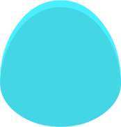

# Image Previews

 antenna-a.png

 antenna-b.png

 antenna-c.png

 arm-a.png

 arm-b.png

 arm-c.png

 arm-d.png

 arm-e.png

 body-a.png

 body-b.png

 body-c.png

 body-d.png

 body-e.png

 body-f.png

 brow-a.png

 brow-b.png

 brow-c.png

 drop-a.png

 drop-b.png

 ear-a.png

 ear-b.png

 eye-a.png

 eye-b.png

 eye-c.png

 eye-d.png

 eye-e.png

 eye-f.png

 eye-g.png

 eye-h.png

 eye-i.png

 eye-j.png

 eye-k.png

 eye-l.png

 eye-m.png

 eye-n.png

 eye-o.png

 eye-p.png

 eye-q.png

 horn-a.png

 horn-b.png

 leg-a.png

 leg-b.png

 leg-c.png

 leg-d.png

 leg-e.png

 mouth-a.png

 mouth-b.png

 mouth-c.png

 mouth-d.png

 mouth-e.png

 mouth-f.png

 mouth-g.png

 mouth-h.png

 mouth-i.png

 mouth-j.png

 mouth-k.png

 mouth-l.png

 mouth-m.png

 mouth-n.png

 nose-a.png

 nose-b.png

 nose-c.png

 nose-d.png

