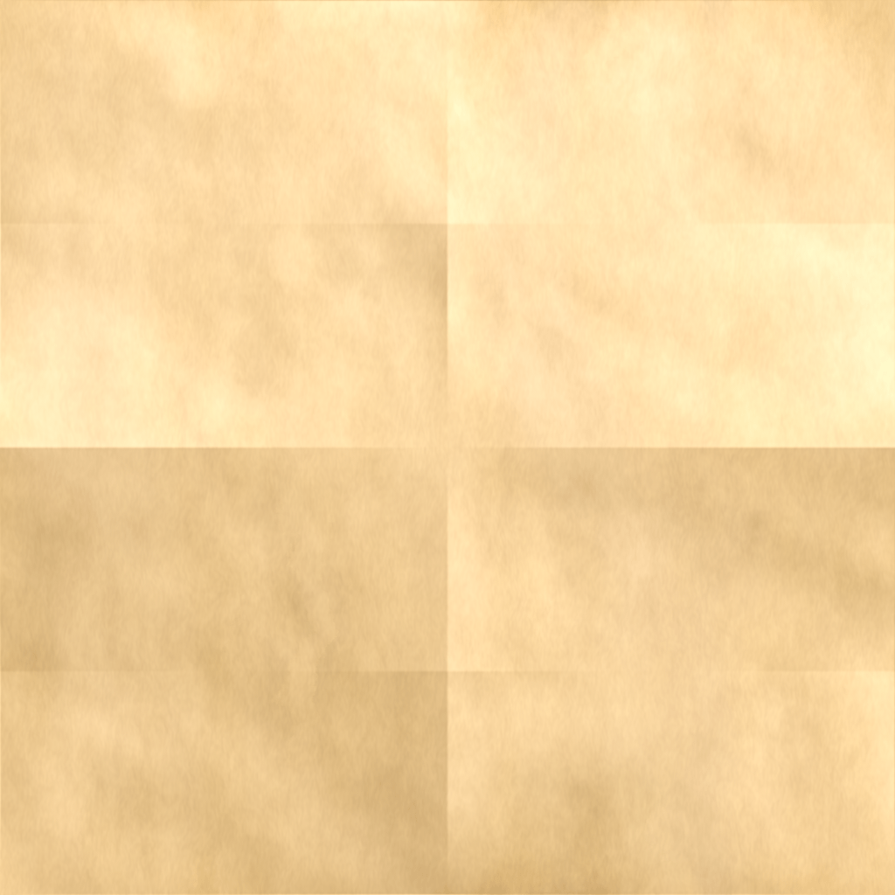

# Image Previews

 background-color-desert.png 

 background-color-fall.png 

 background-color-forest.png 

 background-color-grass.png 

 background-neutral.png 

 bg-layer-1.png 

 bg-layer-2.png 

 bg-layer-3.png 

 bg-layer-4.png 

 blue-desert.png 

 blue-grass.png 

 blue-land.png 

 blue-mountain-bg.png 

 colored-desert.png 

 colored-grass.png 

 colored-land.png 

 forest-0.png 

 forest-1.png 

 forest-2.png 

 forest-bg.png 

 mountainscape.png 

 sandy-bg.png 

 snowy-bg.png 

 tile-beach-1.png 

 tile-beach-2.png 

 tile-checker.png 

 tile-grass-1.png 

 tile-grass-2.png 

 tile-grass-3.png 

 tile-mud.png 

 tile-panel.png 

 tile-parchment.png 

 tile-sand.png 

 tile-space.png 

 tile-water.png 

