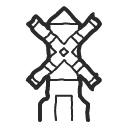

# Image Previews

 map-banner.png 

 map-bridge-rope.png 

 map-bridge.png 

 map-cactus.png 

 map-campfire.png 

 map-castle-tall.png 

 map-castle.png 

 map-chest.png 

 map-church.png 

 map-compass.png 

 map-dock.png 

 map-flag.png 

 map-gate.png 

 map-graveyard.png 

 map-house-chimney.png 

 map-house-small.png 

 map-house-tall.png 

 map-house-viking.png 

 map-house.png 

 map-houses.png 

 map-lake-round.png 

 map-lake.png 

 map-lighthouse.png 

 map-mill.png 

 map-mine.png 

 map-palm.png 

 map-pyramid.png 

 map-rocks-mountain.png 

 map-rocks.png 

 map-ruins.png 

 map-ship.png 

 map-stable.png 

 map-tree-pine-large.png 

 map-tree-pine.png 

 map-vulcano.png 

 map-watchtower.png 

 map-water-wheel.png 

