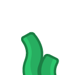

# Image Previews

 bush0.png

 bush1.png

 bush2.png

 bush3.png

 bush4.png

 bush5.png

 bush6.png

 bush7.png

 bush8.png

 coral0.png

 coral1.png

 coral10.png

 coral11.png

 coral2.png

 coral3.png

 coral4.png

 coral5.png

 coral6.png

 coral7.png

 coral8.png

 coral9.png

 cactus.png

 flower0.png

 flower1.png

 flower2.png

 flower3.png

 mushroom_brown.png

 mushroom_red.png

 grass0.png

 grass3.png

 grass4.png

 grass5.png

 grass6.png

 grass7.png

 tree0-alt.png

 tree0.png

 tree1-alt.png

 tree1.png

 tree2-alt.png

 tree2.png

 tree3-alt.png

 tree3.png

 tree4-alt.png

 tree4.png

 tree5-alt.png

 tree5.png

 tree6-alt.png

 tree6.png

 tree7-alt.png

 tree7.png

 tree8-alt.png

 tree8.png

 trunk0.png

 trunk1.png

 trunk2.png

 trunk3.png

 trunk4.png

 trunk5.png

 trunk6.png

 trunk7.png

