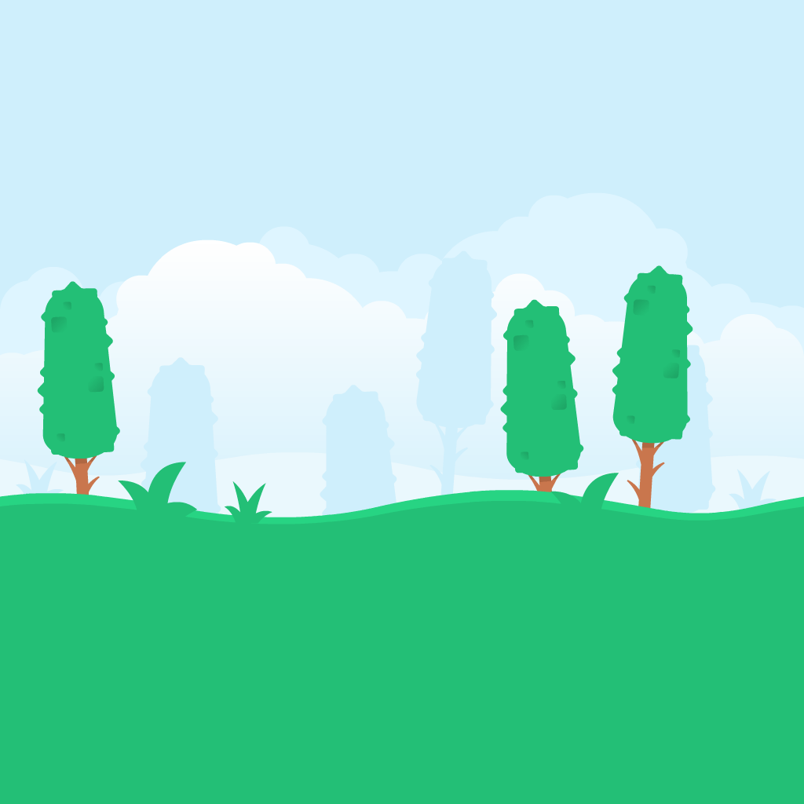
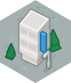
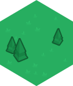
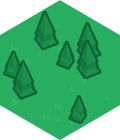
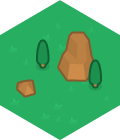
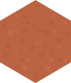
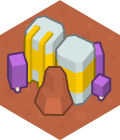
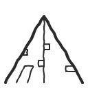
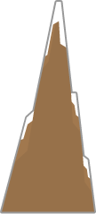

# Image Previews

 background-color-desert.png 

 background-color-fall.png 

 background-color-forest.png 

 background-color-grass.png 

 background-neutral.png 

 bg-layer-1.png 

 bg-layer-2.png 

 bg-layer-3.png 

 bg-layer-4.png 

 blue-desert.png 

 blue-grass.png 

 blue-land.png 

 blue-mountain-bg.png 

 boulder-0.png 

 boulder-1.png 

 boulder-2.png 

 boulder-3.png 

 bush-0.png 

 bush-1.png 

 bush-2.png 

 bush-3.png 

 bush-4.png 

 bush-5.png 

 bush-6.png 

 bush-7.png 

 bush-8.png 

 cactus-0.png 

 cactus-1.png 

 cactus-2.png 

 cake-half-left.png 

 cake-half-mid.png 

 cake-half-right.png 

 cake-half.png 

 castle-small.png 

 cloud-1.png 

 cloud-2.png 

 cloud-3.png 

 cloud-4.png 

 cloud-5.png 

 cloud-6.png 

 cloud-7.png 

 cloud-8.png 

 colored-desert.png 

 colored-grass.png 

 colored-land.png 

 coral-0.png 

 coral-1.png 

 coral-10.png 

 coral-11.png 

 coral-2.png 

 coral-3.png 

 coral-4.png 

 coral-5.png 

 coral-6.png 

 coral-7.png 

 coral-8.png 

 coral-9.png 

 dirt-half-left.png 

 dirt-half-mid.png 

 dirt-half-right.png 

 dirt-half.png 

 dirt.png 

 fence.png 

 flower-0.png 

 flower-1.png 

 flower-2.png 

 flower-3.png 

 forest-0.png 

 forest-1.png 

 forest-2.png 

 forest-bg.png 

 grass-0.png 

 grass-3.png 

 grass-4.png 

 grass-5.png 

 grass-6.png 

 grass-7.png 

 grass-half-left.png 

 grass-half-mid.png 

 grass-half-right.png 

 grass-half.png 

 grass.png 

 ground-cake-broken.png 

 ground-cake-small-broken.png 

 ground-cake-small.png 

 ground-cake.png 

 ground-dirt.png 

 ground-grass-broken.png 

 ground-grass-small-broken.png 

 ground-grass-small.png 

 ground-grass.png 

 ground-grass.png 

 ground-ice.png 

 ground-rock.png 

 ground-sand-broken.png 

 ground-sand-small-broken.png 

 ground-sand-small.png 

 ground-sand.png 

 ground-snow-broken.png 

 ground-snow-small-broken.png 

 ground-snow-small.png 

 ground-snow.png 

 ground-snow.png 

 ground-stone-broken.png 

 ground-stone-small-broken.png 

 ground-stone-small.png 

 ground-stone.png 

 ground-wood-broken.png 

 ground-wood-small-broken.png 

 ground-wood-small.png 

 ground-wood.png 

 hex-concrete-0.png 

 hex-concrete-1.png 

 hex-concrete-10.png 

 hex-concrete-11.png 

 hex-concrete-12.png 

 hex-concrete-13.png 

 hex-concrete-14.png 

 hex-concrete-15.png 

 hex-concrete-16.png 

 hex-concrete-2.png 

 hex-concrete-3.png 

 hex-concrete-4.png 

 hex-concrete-5.png 

 hex-concrete-6.png 

 hex-concrete-7.png 

 hex-concrete-8.png 

 hex-concrete-9.png 

 hex-dirt-0.png 

 hex-dirt-1.png 

 hex-dirt-10.png 

 hex-dirt-11.png 

 hex-dirt-12.png 

 hex-dirt-13.png 

 hex-dirt-14.png 

 hex-dirt-15.png 

 hex-dirt-16.png 

 hex-dirt-17.png 

 hex-dirt-2.png 

 hex-dirt-3.png 

 hex-dirt-4.png 

 hex-dirt-5.png 

 hex-dirt-6.png 

 hex-dirt-7.png 

 hex-dirt-8.png 

 hex-dirt-9.png 

 hex-grass-0.png 

 hex-grass-1.png 

 hex-grass-10.png 

 hex-grass-11.png 

 hex-grass-12.png 

 hex-grass-13.png 

 hex-grass-14.png 

 hex-grass-15.png 

 hex-grass-16.png 

 hex-grass-17.png 

 hex-grass-18.png 

 hex-grass-2.png 

 hex-grass-3.png 

 hex-grass-4.png 

 hex-grass-5.png 

 hex-grass-6.png 

 hex-grass-7.png 

 hex-grass-8.png 

 hex-grass-9.png 

 hex-mars-0.png 

 hex-mars-1.png 

 hex-mars-10.png 

 hex-mars-11.png 

 hex-mars-12.png 

 hex-mars-13.png 

 hex-mars-14.png 

 hex-mars-15.png 

 hex-mars-16.png 

 hex-mars-17.png 

 hex-mars-18.png 

 hex-mars-19.png 

 hex-mars-2.png 

 hex-mars-20.png 

 hex-mars-21.png 

 hex-mars-22.png 

 hex-mars-23.png 

 hex-mars-24.png 

 hex-mars-25.png 

 hex-mars-3.png 

 hex-mars-4.png 

 hex-mars-5.png 

 hex-mars-6.png 

 hex-mars-7.png 

 hex-mars-8.png 

 hex-mars-9.png 

 hex-sand-0.png 

 hex-sand-1.png 

 hex-sand-10.png 

 hex-sand-11.png 

 hex-sand-12.png 

 hex-sand-13.png 

 hex-sand-2.png 

 hex-sand-3.png 

 hex-sand-4.png 

 hex-sand-5.png 

 hex-sand-6.png 

 hex-sand-7.png 

 hex-sand-8.png 

 hex-sand-9.png 

 house-1.png 

 house-2.png 

 house-small-1.png 

 house-small-2.png 

 igloo.png 

 lava-top-high.png 

 map-banner.png 

 map-bridge-rope.png 

 map-bridge.png 

 map-cactus.png 

 map-campfire.png 

 map-castle-tall.png 

 map-castle.png 

 map-chest.png 

 map-church.png 

 map-compass.png 

 map-dock.png 

 map-flag.png 

 map-gate.png 

 map-graveyard.png 

 map-house-chimney.png 

 map-house-small.png 

 map-house-tall.png 

 map-house-viking.png 

 map-house.png 

 map-houses.png 

 map-lake-round.png 

 map-lake.png 

 map-lighthouse.png 

 map-mill.png 

 map-mine.png 

 map-palm.png 

 map-pyramid.png 

 map-rocks-mountain.png 

 map-rocks.png 

 map-ruins.png 

 map-ship.png 

 map-stable.png 

 map-tree-pine-large.png 

 map-tree-pine.png 

 map-vulcano.png 

 map-watchtower.png 

 map-water-wheel.png 

 moon-0.png 

 moon-1.png 

 moon-2.png 

 mountain-0.png 

 mountain-1.png 

 mountain-2.png 

 mountain-3.png 

 mountain-4.png 

 mountain-5.png 

 mountain-6.png 

 mountain-7.png 

 mountain-8.png 

 mountainscape.png 

 mushroom-brown.png 

 mushroom-red.png 

 planet-half-left.png 

 planet-half-mid.png 

 planet-half-right.png 

 planet-half.png 

 pyramid-1.png 

 pyramid-2.png 

 rock-0.png 

 rock-1.png 

 rock-down.png 

 rock-grass-down.png 

 rock-grass.png 

 rock-ice-down.png 

 rock-ice.png 

 rock-snow-down.png 

 rock-snow.png 

 rock-top-0.png 

 rock-top-1.png 

 rock-top-2.png 

 rock-top-3.png 

 rock-top-4.png 

 rock-top-5.png 

 rock.png 

 sand.png 

 sandfloor-0.png 

 sandfloor-1.png 

 sandfloor-2.png 

 sandfloor-3.png 

 sandfloor-4.png 

 sandfloor-5.png 

 sandy-bg.png 

 snow-rock-0.png 

 snow-rock-1.png 

 snow-rock-2.png 

 snow-rock-3.png 

 snow.png 

 snowman.png 

 snowy-bg.png 

 spike-bottom.png 

 spike-top.png 

 spikes-bottom.png 

 spikes-top.png 

 tile-beach-1.png 

 tile-beach-2.png 

 tile-checker.png 

 tile-exclamation.png 

 tile-grass-1.png 

 tile-grass-2.png 

 tile-grass-3.png 

 tile-grey.png 

 tile-half.png 

 tile-mud.png 

 tile-panel.png 

 tile-parchment.png 

 tile-sand.png 

 tile-space.png 

 tile-water.png 

 tile.png 

 tower-small.png 

 tower.png 

 tree-0-alt.png 

 tree-0.png 

 tree-1-alt.png 

 tree-1.png 

 tree-2-alt.png 

 tree-2.png 

 tree-3-alt.png 

 tree-3.png 

 tree-4-alt.png 

 tree-4.png 

 tree-5-alt.png 

 tree-5.png 

 tree-6-alt.png 

 tree-6.png 

 tree-7-alt.png 

 tree-7.png 

 tree-8-alt.png 

 tree-8.png 

 tree-top-alt.png 

 tree-top.png 

 tree-twigs-alt.png 

 tree-twigs.png 

 trunk-0.png 

 trunk-1.png 

 trunk-2.png 

 trunk-3.png 

 trunk-4.png 

 trunk-5.png 

 trunk-6.png 

 trunk-7.png 

 water-top-high.png 

